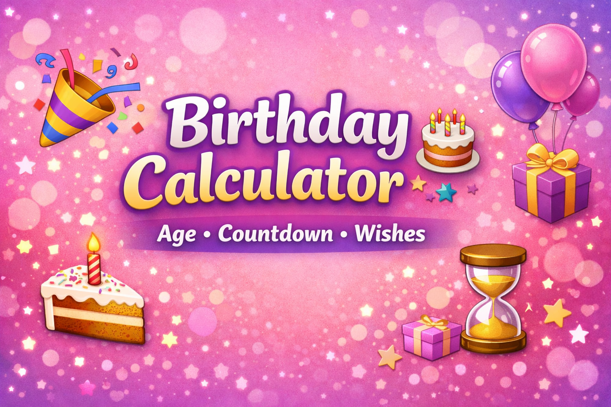
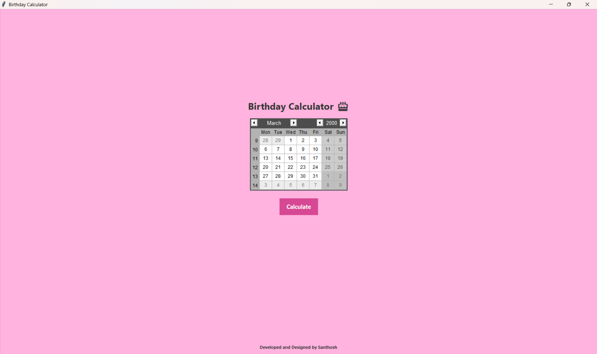
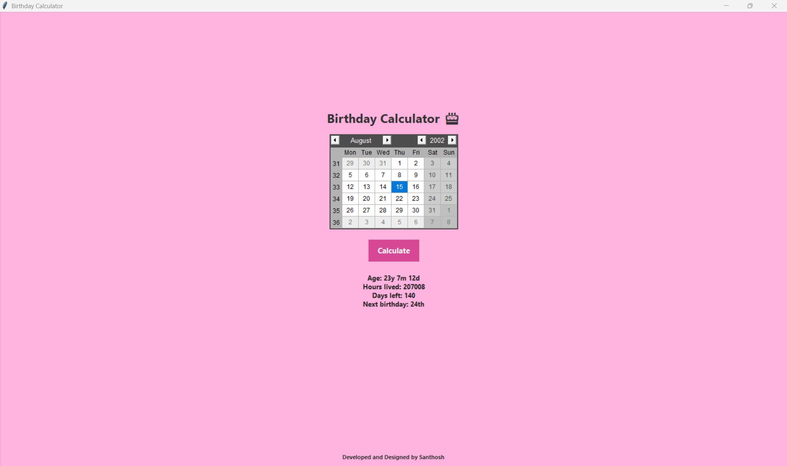
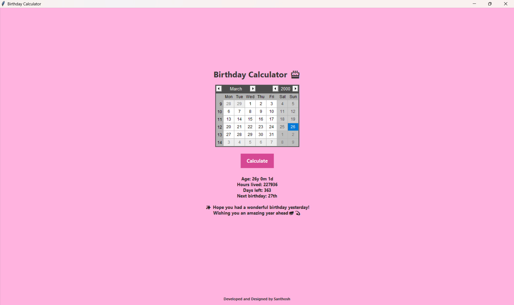
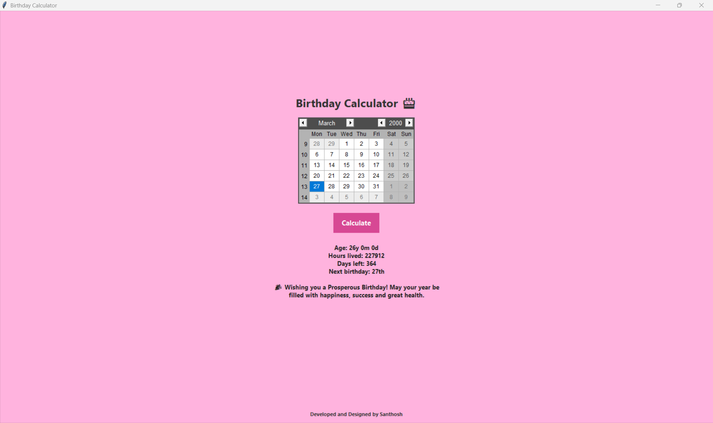
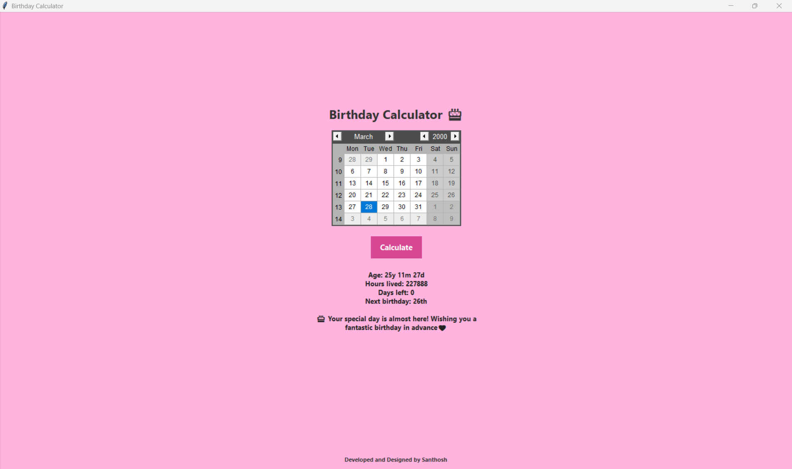

# 🎂 Birthday Calculator

A simple and interactive Birthday Calculator built using Python and Tkinter. It calculates your exact age, hours lived, days left for your next birthday, and displays personalized birthday wishes. Designed with a clean UI and calendar input for a smooth user experience.

---

## 🚀 Features

- 📅 Calendar-based date selection
- 🎯 Accurate age calculation (years, months, days)
- ⏳ Total hours lived
- 🎂 Days left for next birthday
- 💬 Smart birthday wishes (today, yesterday, tomorrow)
- 🎨 Clean and colorful UI using Tkinter

---

## 🛠️ Tech Stack

- Python
- Tkinter
- tkcalendar
- python-dateutil

---

## 📥 Installation

### 1. Install Python

Download and install Python from:
https://www.python.org/downloads/

✔ Make sure to check **"Add Python to PATH"** during installation.

---

### 2. Clone the Repository

```bash
git clone https://github.com/your-username/birthday-calculator.git
cd birthday-calculator
```

### 3. Install Required Packages
```
pip install tkcalendar python-dateutil
```

Create requirements.txt (Dependencies File)

To create a dependency file:
```
pip freeze > requirements.txt
```

To install from this file:
```
pip install -r requirements.txt
```

📁 Project Structure
```
birthday-calculator/
│── app.py
│── requirements.txt
│── user_data.json
│── README.md
│── assets/
    ├── Banner.png        # GitHub banner
    ├── icon.ico          # Application icon (for exe later)
    ├── bg.png            # Optional background (for exe later)
    ├── logo.png          # Small logo (for exe later)
    └── fonts/            # Custom fonts (Poppins) (for exe later)
│── screenshots/
    ├── UI.png
    ├── Yesterday_Bday.png
    ├── Today_Bday.png
    ├── Tommorow_Bday.png
    └── X_Days_Left_for_Birthday.png
└── video/
    └── Demo.mp4
```


Run the Application
```
python app.py
```

## 🧑‍💻 Usage
```
1. Select your date of birth 📅  
2. Click Calculate  
3. View:
   - Age
   - Hours lived
   - Days left
   - Birthday wishes 🎉
```

## 📸 Screenshots

### 🖥️ Main UI


### 📊 Result Output

&nbsp;

&nbsp;

&nbsp;


### 🎥 Demo Video

[](https://www.youtube.com/watch?v=p7I4dtwGO8k)

### 🧑‍💻 Future Work
```
1.Convert this into a .exe Desktop Application
2.To deploy as a Web Application (Streamlit)🌐
3.Redesign UI like a Modern Application (customtkinter)😎
```

## 👨‍💻 Developer

**Santhosh Kumar**

© Made with ❤️ by Santhosh
